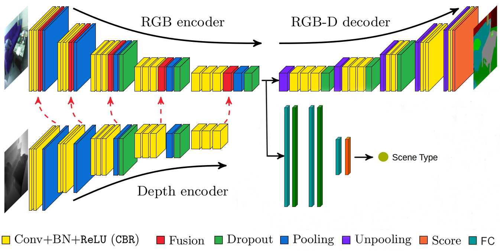

# FuseNet

This repository contains PyTorch implementation of FuseNet-SF5 architecture from the paper which is used to detect small obstacles
[FuseNet: incorporating depth into semantic segmentation via fusion-based CNN architecture](https://pdfs.semanticscholar.org/9360/ce51ec055c05fd0384343792c58363383952.pdf). 
The number of classified classes is 6, including background-1, chair-2, cylinder-3, foot-4, short_box-5, tall_box-6.

For mobie device useage, we change the conventional conv layer in FuseNet into depth conv, which is inspired by this paper
[MobileNet:Efficient Convolutional Neural Networks for Mobile Vision Applications](https://arxiv.org/pdf/1704.04861.pdf%EF%BC%89).

Other implementations of FuseNet:
[[Caffe]](https://github.com/tum-vision/fusenet) 
[[PyTorch]](https://github.com/MehmetAygun/fusenet-pytorch)

<p align="center"></p>

## Installation
Prerequisites:
- python 3.6
- Nvidia GPU + CUDA cuDNN

Clone the repository and install the required packages:
```bash
git clone git@gitlab.pudu.work:chenxinqi/rgbd_small_obstacle.git
cd FuseNet_PyTorch
pip3 install -r requirements.txt
```
## Datasets 

### Self-made dataset
- Simply, create a directory named datasets in the main project directory and a dirctory named out in the sub project directory, and in out directory create 6 directories named rgb, depth, label, test_rgb, test_depth, test_label.And then put your images and labels into the correspoding directory. 
- Rgb image values have been normalized so that they fall into 0-255 range. 
- If you want to label your predicted pictures, go to `lable_solver` folder and  run `label_solver.py` to re-label your results.
- If you want to change the resolution of your images(from 480*640 to 240*320),  go to `label_solver` folder and run `label_resize` to obtain the resized label(.npy type).

## Training
- To train FuseNet, run `fusenet_train.py` by providing the path of the dataset. 
- If you would like to train a FuseNet model with the classification head, provide `--use_class True`
- Example training commands can be found below.

### Training from scratch
w/o classification head:
```bash
python3 fusenet_train.py --dataroot ./datasets/out --batch_size 8 --lr 0.005
```

w/ classification head:
```bash
python3 fusenet_train.py --dataroot ./datasets/out --batch_size 8 --lr 0.005 \
                        --num_epochs 200 --use_class True --name experiment_1
```

### Resuming training from a checkpoint
w/o classification head:
```bash
python3 fusenet_train.py --dataroot ./datasets/out --resume_train True --batch_size 8 \
                        --load_checkpoint ./checkpoints/upsample_maxunpool2d_crop_cross_validate/selfmade/best_model_1.pth.tar  --lr 0.01
```

w classification head:
```bash
python3 fusenet_train.py --dataroot ./datasets/out --resume_train True --use_class True --batch_size 8 \
                        --load_checkpoint ./checkpoints/upsample_maxunpool2d_crop_cross_validate/selfmade/best_model_1.pth.tar  --lr 0.01 \
                        --lambda_class_range 0.004 0.01 5
```

Note: When training a model that contains the classification head, by default the lambda value, [which is the coefficient of the classification loss](/images/loss.PNG), is set to
0.001. In order to train the model for multiple sessions with multiple lambda values, following option should be added to the run command: ```--lambda_class_range start_value,
end_value, steps_between```. To train the model with only one session with one lambda value, set the start_value and the end_value the same, and the step_size to 1. 

## Inference
- To evaluate FuseNet results, run `fusenet_test.py`. Do not forget to include the 'class' word in the checkpoint file name when loading a model that contains 
the classification head.
- Model's semantic segmentation performance on the given dataset will be evaluated in three accuracy measures: global pixel-wise classification accuracy, 
intersection over union, and mean accuracy.
- Example run command:
```bash
python3 fusenet_test.py --dataroot ./datasets/out --load_checkpoint ./checkpoints/upsample_maxunpool2d_crop_cross_validate/selfmade/best_model_1.pth.tar 
```

Note: To visualize the resulting images within the testing process, add `--vis_results True` option.  

- Current semantic segmentation results on self-made dataset:
<table align="center">
<tr>
<td><b>Self-made dataset <td><b> Global <td><b> IoU 
<tr>
<td><a href="https://goo.gl/hcUFMy"><b> 480*640 </a><td> 98.2 <td> 86.7 
<tr>
<td><a href="https://goo.gl/hcUFMy"><b> 240*320 </a><td> 95.3 <td> 81.1 
</table>

- Other pretrained FuseNet models will be uploaded soon.

## Plotting loss and accuracy history graphs
- To plot the loss and accuracy history of a model, use `fusenet_plots.ipynb` notebook.

## Result Visualization
- To visualize segmentation predictions separately, run `fusenet_visualize.py` script. Do not forget to include the 'class' word in the checkpoint file name when loading a model
that contains the classification head.
- Example run command:
```bash
python3 fusenet_visualize.py --load_checkpoint ./checkpoints/mobile_experiment/selfmade/best_model_1.pth.tar 
```
- To visualize cross-validation segmentation predictions , run `fusenet_cross_visualize.py` script.
- Example run command:
```bash
python3 fusenet_cross_visualize.py --load_checkpoint ./checkpoints/upsample_maxunpool2d_crop_cross_validate/selfmade/best_model_1.pth.tar 
```
- Sample output images on Self-made dataset (RGB - Ground Truth - Prediction):

<p align="center" float="left">
</p>
<p align="center" float="left">
</p>
<p align="center" float="left">
</p>
## Convert to onnx

- If you want to use your already trained model to predict real-time result in your mobile terminal, one recommended way is to convert your model type(typical as .pth.tar)  to .onnx. And then you can convert the .onnx into other mobile model type, such as NCNN, which is  developed by Tencent.
- Run `pytorch_to_onnx.py`  to change your model, remember to change the path of your saved model.
- Run `onnx_bushu.py` to show the prediction on your .onnx model, remember to change the path of your input pictures.
- For follwing operations, you can check the codes in `ncnn_demo` folder, and go to the website of [NCNN](https://github.com/Tencent/ncnn) to find more help.


## Citing FuseNet

Caner Hazirbas, Lingni Ma, Csaba Domokos and Daniel Cremers, _"FuseNet: Incorporating Depth into Semantic Segmentation via Fusion-based CNN Architecture"_, in proceedings of the 13th Asian Conference on Computer Vision, 2016.

    @inproceedings{fusenet2016accv,
     author    = "C. Hazirbas and L. Ma and C. Domokos and D. Cremers",
     title     = "FuseNet: incorporating depth into semantic segmentation via fusion-based CNN architecture",
     booktitle = "Asian Conference on Computer Vision",
     year      = "2016",
     month     = "November",
    }
